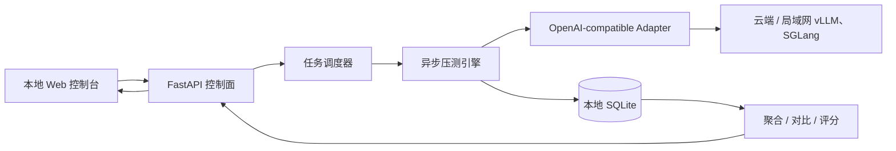
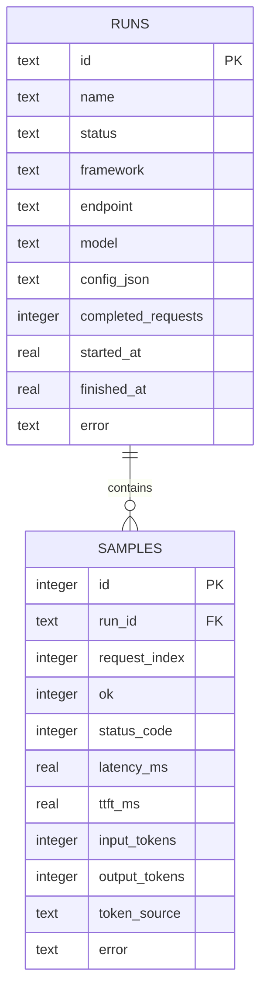

# InferBench Local — 架构设计

## 1. 目标与边界

InferBench Local 是一个本地控制、远程施压、本地留存结果的推理 API 压测台。首版统一压测 vLLM、SGLang 以及其他兼容 OpenAI Chat Completions 的服务。



### 本地保存

- 实验配置（API Key 除外）
- 每个请求的原始时序、token 数、状态和错误
- 可复算的汇总指标与测试环境备注

### 不在首版内

- 分布式 load generator
- GPU/CPU/DCGM 服务端遥测采集
- 多租户认证与团队共享
- 非 OpenAI-compatible 的私有 RPC 协议

这些能力均有明确扩展点，但不应增加本地 MVP 的启动成本。

## 2. 组件

| 组件 | 职责 | 技术 |
|---|---|---|
| Dashboard | 创建任务、展示进度、查看详情、选择多次实验对比 | 原生 HTML/CSS/JS + SVG |
| Control API | 参数校验、任务生命周期、查询和导出 | FastAPI |
| Runner | 固定并发 worker、请求编排、warmup、取消 | asyncio |
| Protocol Adapter | 构造请求、解析 SSE、提取 usage/error | httpx |
| Metrics | percentile、吞吐、TTFT、ITL、成功率和评分 | Python |
| Repository | 实验与请求样本事务化保存 | SQLite (WAL) |
| Mock target | 模拟 OpenAI SSE 接口，用于无 GPU 自测 | FastAPI route |

## 3. 请求生命周期

1. 用户在本地 UI 提交目标 URL、模型、并发矩阵（默认 1/2/4/8）、请求数和 prompts。
2. UI 为每个并发档创建至少 3 个独立 repetition run；API 校验 URL 与负载上限，清除配置中的 API Key 后创建记录，并自动将整组 run 加入对比选择。
3. 本地 Runner 使用全局 benchmark slot 将 run 串行化。每轮先执行不计入指标的 warmup，再开始计时并由固定数量 worker 消费请求队列。
4. Adapter 对每个请求记录：开始时间、第一个内容 chunk、结束时间、HTTP 状态、usage。
5. 每完成一个请求即写入本地 SQLite，UI 轮询任务状态得到实时进度。
6. 任务结束后计算汇总指标；详情页从原始样本重新组织分布图和异常信息。
7. Compare API 先按 suite + concurrency 对重复轮次求算术平均值并计算 CV，再归一化输出相对基线变化与综合评分。

## 4. 指标口径

| 指标 | 定义 |
|---|---|
| Latency | 从发出请求到流结束的 wall time |
| TTFT | 从发出请求到首个非空文本 chunk |
| TPOT | `(Latency - TTFT) / max(output_tokens - 1, 1)` |
| Output TPS | 所有成功请求输出 token 总数 / 压测 wall time |
| Request throughput | 成功请求数 / 压测 wall time |
| Success rate | 成功请求数 / 总请求数 |
| P50/P95/P99 | 对成功请求 wall latency 的线性插值 percentile |

Token 数优先使用响应的 `usage`。当服务不在 stream 结尾返回 usage 时，以约 4 字符/token 的启发式估算，且在样本和 UI 中标记 `estimated`。

### 综合性能评分

对一次 compare 中的候选实验分别归一化，范围为 0–100：

```text
score = 35% output_throughput
      + 25% inverse(TTFT P50)
      + 25% inverse(latency P95)
      + 15% success_rate
```

评分仅用于同组实验排序，不跨硬件、模型、prompt 数据集或采样参数比较。界面会显示原始指标与相对基线变化，避免用单一分数掩盖权衡。

每个并发档默认运行 3 轮。对吞吐、TTFT、P95 等指标分别求三轮算术平均；同时展示 `CV = population_stddev / mean`。CV 越小，三轮结果越稳定。

## 5. 数据模型



SQLite 启用 WAL 和外键。汇总值默认查询时由样本计算，保证指标公式升级后历史数据仍可重算。

## 6. API 草案

- `POST /api/runs`：创建并启动压测
- `GET /api/runs`：历史列表
- `GET /api/runs/{id}`：配置、汇总和请求样本
- `POST /api/runs/{id}/cancel`：取消运行中任务
- `DELETE /api/runs/{id}`：删除已结束实验
- `GET /api/compare?aggregate=true&ids=a,b,...`：按重复轮次求均值后对比与评分
- `GET /api/health`：本地服务健康检查
- `POST /mock/v1/chat/completions`：本地 SSE 模拟目标

## 7. 安全与可靠性

- API Key 仅通过创建任务请求进入内存，不写数据库、不返回给浏览器历史接口。
- 默认只监听 `127.0.0.1`；需要局域网共享时由用户显式改为 `0.0.0.0`。
- 请求设连接、读取和总时限；单请求异常不会终止整个 run。
- 配置限制最大并发和最大请求数，避免误操作耗尽本机资源或产生意外云账单。
- 取消采用 cooperative cancellation；已完成样本不丢失，run 标为 `cancelled`。

## 8. 扩展路线

1. 增加 Completions、Embeddings 和自定义 adapter。
2. 支持 JSONL/HuggingFace 数据集、固定速率与 Poisson 到达模型。
3. 在被测服务旁部署轻量 telemetry sidecar，采集 GPU 利用率、显存和功耗。
4. 将 Runner 抽象为远程 agent，控制面仍保留本地，支持多地域压测。
5. 导出 JSON/CSV 与可复现实验 manifest，接入 CI 回归阈值。
