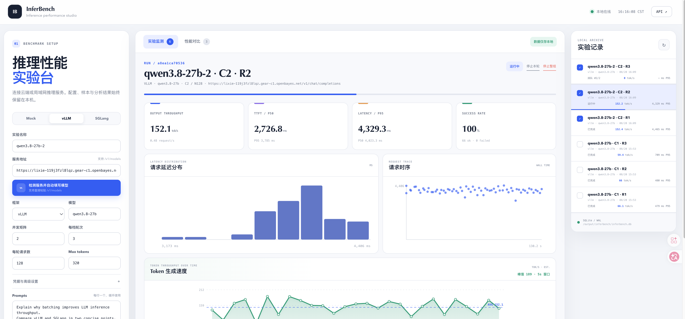
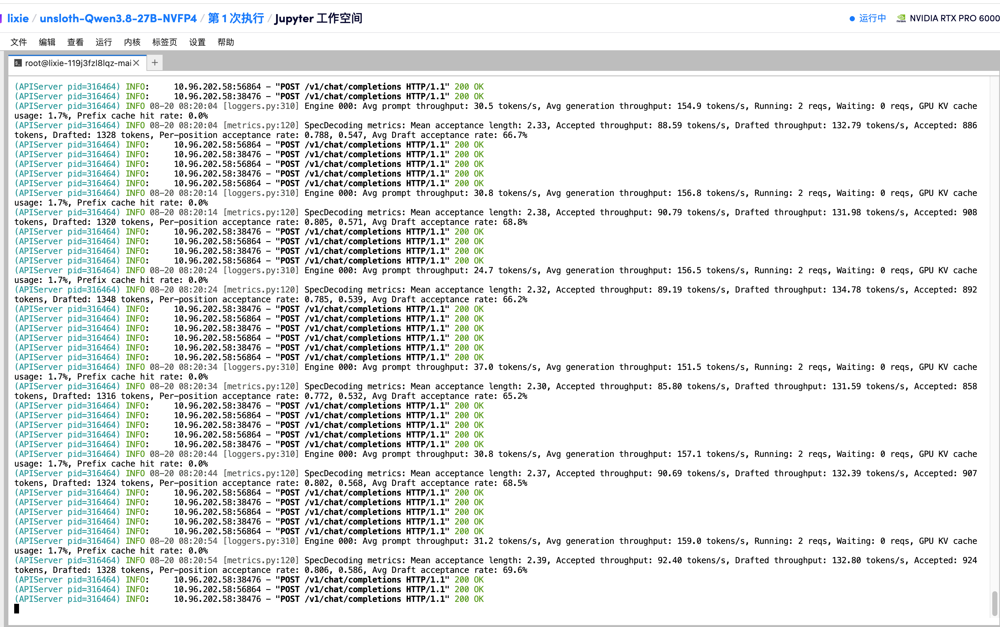
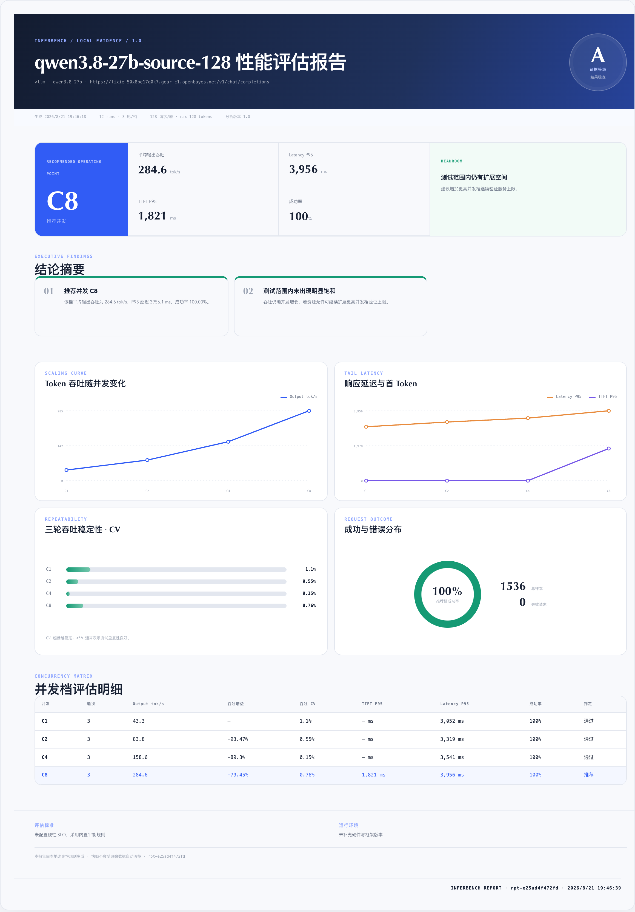

# InferBench Local

[](LICENSE)

InferBench Local 是面向 vLLM、SGLang 和其他 OpenAI-compatible 推理服务的本地压测与可视化工作台。控制面、原始请求指标和实验历史都保留在本机；被测服务可以部署在本机、局域网或云端。

## 效果展示

### 压测工作台

实时查看吞吐、TTFT、P95 延迟、成功率、请求分布与 Token 生成速度，并在右侧切换历史实验。



### 真实推理服务压测

InferBench 通过 OpenAI-compatible API 对远端 vLLM 服务持续发起并发流式请求，服务端日志可同步观察生成吞吐、请求状态和推测解码指标。



### 自动性能评估报告

并发矩阵全部完成后，InferBench 会根据本地保存的原始样本自动生成图文报告，汇总推荐并发、吞吐扩展、尾延迟、三轮稳定性、成功率和并发档明细。



## 能力

- 对 `/v1/chat/completions` 发起真实 SSE 流式并发请求
- 默认一键运行 `1 / 2 / 4 / 8` 四档并发矩阵，每档至少 3 轮
- 默认最多生成 `128 tokens`，兼顾标准吞吐测试的有效性与执行时间
- 采集 TTFT、端到端延迟、TPOT、输出 token/s、request/s 和成功率
- SQLite 本地持久化请求级样本，API Key 不落盘
- 本地仪表盘查看运行进度、延迟分布、错误与历史记录
- 展示压测期间的 Token 生成速度曲线、峰值和整轮平均 tok/s 基准线
- 支持立即停止本轮或整组矩阵；停止会取消排队任务并中断正在读取的流式连接
- 支持批量选择和删除多个已结束实验，运行中或排队记录会自动保护
- 选择 2–8 次实验，以首项为基线对比并生成透明综合评分
- 矩阵完成后自动生成本地图文性能报告，给出饱和拐点、推荐并发和数据质量等级
- 报告支持自定义 SLO 与运行环境，并可导出 JSON、独立 HTML、打印 PDF 或复制长图
- 内置 mock OpenAI endpoint，无 GPU 也能跑通完整流程

详细设计见 [ARCHITECTURE.md](ARCHITECTURE.md)，代码贡献与版本发布规则见 [CONTRIBUTING.md](CONTRIBUTING.md)，智能体可从 [AGENTS.md](AGENTS.md) 和 [docs/README.md](docs/README.md) 渐进读取仓库知识。

## Docker 部署（推荐）

在项目目录运行：

```bash
docker compose up -d --build
```

如果云端推理服务需要 API Key，可在启动前注入容器；随后在页面“Key 环境变量”填写 `INFERENCE_API_KEY`：

```bash
export INFERENCE_API_KEY='...'
docker compose up -d --build
```

打开 <http://127.0.0.1:8080>，查看运行状态：

```bash
docker compose ps
docker compose logs -f inferbench
```

### 构建并发布多架构镜像

仓库发布脚本默认从项目版本文件读取 Tag，构建 `linux/amd64` 和 `linux/arm64`，并推送到 UHub。先统一声明当前源码对应的镜像变量：

```bash
INFERBENCH_VERSION="$(python3 -c 'from inferbench import __version__; print(__version__)')"
INFERBENCH_TAG="v${INFERBENCH_VERSION}"
INFERBENCH_IMAGE="uhub.service.ucloud.cn/openbayes_common/inferbench:${INFERBENCH_TAG}"
docker login uhub.service.ucloud.cn
./scripts/build-multiarch.sh
```

使用其他标签或镜像名：

```bash
TAG="${INFERBENCH_TAG}" ./scripts/build-multiarch.sh
IMAGE=uhub.service.ucloud.cn/openbayes_common/inferbench TAG="${INFERBENCH_TAG}" \
  ./scripts/build-multiarch.sh
```

只做本地构建验证（不推送；`--load` 会加载当前 Docker 主机架构）：

```bash
PUSH=0 ./scripts/build-multiarch.sh
```

目标机器可直接使用发布镜像启动：

```bash
INFERBENCH_IMAGE="${INFERBENCH_IMAGE}" docker compose pull
INFERBENCH_IMAGE="${INFERBENCH_IMAGE}" docker compose up -d
```

容器内只运行一个 InferBench 进程，并把 SQLite 数据写入 `/data`。Compose 将其挂载到项目内独立的 `./docker-data/`，所以这是一个**全新数据库**：当前项目的 `./data/inferbench.db` 不会复制或迁移进去。容器更新或重建不会丢失该部署后产生的数据，迁移到其他机器时也可以按需单独备份这个目录。

停止和再次启动：

```bash
docker compose stop
docker compose start
```

移除容器但保留数据库：

```bash
docker compose down
```

`docker compose down` 不会删除 `./docker-data/`。如需复制或备份数据库，建议先停止容器，避免复制到写入中的 SQLite 文件。

### 部署到其他机器

目标机器只需要安装 Docker 与 Docker Compose。把整个 `inferbench-local/` 项目目录复制或通过 Git 拉取到目标机器，然后执行：

```bash
cd inferbench-local
docker compose up -d --build
curl http://127.0.0.1:8080/api/health
```

同一局域网可通过 `http://服务器IP:8080` 访问。InferBench 当前没有用户登录鉴权；如果跨公网使用，不要直接暴露 8080，请在反向代理或云负载均衡层增加 HTTPS、身份认证和来源 IP 限制。

新机器默认从空的 `docker-data/` 开始，不需要迁移当前数据库。如果以后需要携带容器部署产生的历史记录，请先 `docker compose stop`，再复制整个 `docker-data/` 目录。

## Helm / Kubernetes 部署

仓库提供 [InferBench Helm Chart](charts/inferbench)。需要 Kubernetes 1.23+、Helm 3，以及可用的 ReadWriteOnce StorageClass。Chart 不写死应用版本，会自动选择仓库最新发布 Tag 作为安装变量：

```bash
INFERBENCH_TAG="$(git tag --list 'v*' --sort=-version:refname | head -n 1)"
test -n "${INFERBENCH_TAG}"

helm upgrade --install inferbench ./charts/inferbench \
  --namespace inferbench \
  --create-namespace \
  --set-string image.tag="${INFERBENCH_TAG}"
```

检查状态并通过本地端口访问：

```bash
kubectl -n inferbench get pods,svc,pvc
helm test inferbench -n inferbench
kubectl -n inferbench port-forward service/inferbench 8080:80
```

然后打开 <http://127.0.0.1:8080>。

如果 UHub 仓库需要登录，先创建拉取凭据，并在安装时引用它：

```bash
kubectl -n inferbench create secret docker-registry uhub-credentials \
  --docker-server=uhub.service.ucloud.cn \
  --docker-username="${UCLOUD_USER}" \
  --docker-password="${UCLOUD_PASS}"

helm upgrade --install inferbench ./charts/inferbench \
  --namespace inferbench \
  --create-namespace \
  --set-string image.tag="${INFERBENCH_TAG}" \
  --set 'imagePullSecrets[0].name=uhub-credentials'
```

使用已有 PVC 或已有 API Key Secret：

```bash
helm upgrade --install inferbench ./charts/inferbench \
  --namespace inferbench \
  --set-string image.tag="${INFERBENCH_TAG}" \
  --set persistence.existingClaim=inferbench-data \
  --set apiKey.existingSecret=inferbench-api
```

开启 Ingress 时必须同时配置入口控制器和域名，并在公网网关增加身份认证：

```bash
helm upgrade --install inferbench ./charts/inferbench \
  --namespace inferbench \
  --set-string image.tag="${INFERBENCH_TAG}" \
  --set ingress.enabled=true \
  --set ingress.className=nginx \
  --set 'ingress.hosts[0].host=inferbench.example.com' \
  --set 'ingress.hosts[0].paths[0].path=/' \
  --set 'ingress.hosts[0].paths[0].pathType=Prefix'
```

默认 PVC 带有 `helm.sh/resource-policy: keep`，因此 `helm uninstall inferbench -n inferbench` 不会删除压测数据库。完整配置见 [values.yaml](charts/inferbench/values.yaml)。SQLite 架构只支持 `replicaCount: 1`，Chart 会拒绝多副本配置。

## Python 本地启动

需要 Python 3.10+：

```bash
python3 -m venv .venv
source .venv/bin/activate
pip install -e '.[dev]'
inferbench
```

打开 <http://127.0.0.1:8080>。默认表单指向内置 mock endpoint，直接点击“开始压测”即可。

默认每轮运行 128 个请求，并发矩阵为 `1, 2, 4, 8`，每档 3 轮。所有 run 串行施压，避免档位之间竞争同一推理服务而污染结果。三项都可在表单修改；并发矩阵支持逗号或空格分隔，一次最多 8 档，每档最少 3 轮。

运行时主面板会优先展示真正执行中的轮次，排队项会显示队列位置。点击“停止本轮”会立即中断该轮；点击“停止整组”会取消同一矩阵中全部运行和排队轮次，已经采集的样本仍然保留。若本地进程异常退出，下次启动会自动把遗留的 `queued/running` 记录收口为“已取消”。

也可以不激活虚拟环境：

```bash
.venv/bin/inferbench --port 8080
```

默认数据文件为 `./data/inferbench.db`。可指定其他目录：

```bash
inferbench --data-dir /path/to/local-data
```

## 连接 vLLM / SGLang 云端

在仪表盘填写完整 Chat Completions URL，例如：

```text
https://inference.example.com/v1/chat/completions
```

也可以直接粘贴 `.../v1/models`，点击“检测服务并自动填写模型与实验名称”。工具会读取模型 ID，将其同步填写为模型和实验名称，并自动转换成对应的 `/v1/chat/completions` 地址。

API Key 有两种安全等级不同的输入方式：

1. 在表单中临时输入：只在本次任务内存中使用，不写入 SQLite。
2. 先设置环境变量，再在表单“Key 环境变量”中填写变量名（推荐）：

```bash
export INFERENCE_API_KEY='...'
inferbench
```

vLLM 和 SGLang 的服务端只需开启其 OpenAI-compatible HTTP server。本工具不会在云端安装 agent。

## 指标解读

- **TTFT**：请求发出到首个非空文本 chunk，越低越好。
- **P95 latency**：95% 成功请求在此时间内完成，越低越好。
- **TPOT**：首 token 之后每个输出 token 的平均耗时，越低越好。
- **Output TPS**：整个 run 的成功输出 token / wall time，越高越好。
- **Token 速度曲线**：将每个成功请求的输出 token 按 `TTFT → 完成时刻` 的解码区间分摊，再按自适应时间窗口汇总为 tok/s。点击曲线圆点可固定查看对应时间和 tok/s，点击图表空白关闭；它适用于已有历史数据，但属于客户端请求级估算，不是服务端逐 token 遥测。
- **Success rate**：成功请求比例。

## 导出测试数据

实验详情页的“请求样本”区域提供“导出 CSV”和“导出 JSON”按钮。导出内容来自当前实验的本地 SQLite 记录：CSV 适合用 Excel、Numbers 或 pandas 做进一步分析，JSON 会保留完整的实验配置、汇总指标和请求样本。也可以直接调用 `GET /api/runs/{id}/export?format=csv` 或 `format=json`。

实验标题旁的“复制测试图”会生成一张包含实验信息、四项核心指标、延迟分布、请求时序和 Token 速度曲线的 PNG，并复制到系统剪贴板。HTTPS 或 localhost 可直接粘贴到文档和聊天工具；普通 HTTP 环境会自动改为下载 PNG。

Compare 会先按并发档对重复轮次求均值，再进行评分，并展示吞吐 CV（标准差 / 均值）衡量稳定性。综合评分只适合在同一个 compare 组中排序。模型、prompt 数据集或生成参数不一致时，界面和 API 会给出可比性警告。

## 自动性能报告

一组并发矩阵的全部轮次结束后，工作台会自动生成一份版本化报告快照。报告使用本地确定性规则分析吞吐扩展、P95 延迟、TTFT、成功率和三轮 CV：当下一档吞吐增益低于 10%、同时 P95 延迟增长超过 30%，或成功率跌破 99% 时，会标记饱和拐点，并在拐点前选择满足条件且吞吐最高的并发档。没有硬性 SLO 时，推荐只代表默认平衡规则，不等同于生产容量承诺。

“性能报告”页可以补充最低成功率、最低吞吐、TTFT/Latency P95 上限，以及硬件、框架版本和备注。保存后会用同一批原始样本重新分析。报告记录分析版本、run IDs 和生成时间，不包含 API Key、完整 prompt 或响应正文；可导出 JSON、独立 HTML、浏览器打印 PDF，以及复制或下载 PNG 长图。整个过程不需要配置外部模型 API。

## API

启动后访问 <http://127.0.0.1:8080/docs> 查看 OpenAPI 文档。核心接口：

- `POST /api/runs`
- `GET /api/runs`
- `GET /api/runs/{id}`
- `GET /api/runs/{id}/export?format=csv|json`
- `POST /api/runs/{id}/cancel`
- `POST /api/suites/{suite_id}/cancel`
- `DELETE /api/runs/{id}`
- `GET /api/compare?ids=a,b`
- `GET|POST /api/reports`
- `GET|PUT|DELETE /api/reports/{id}`
- `GET /api/reports/{id}/export`

## 测试

```bash
./scripts/verify.sh
```

统一验证包含 Python 测试、仓库不变量、前端 JavaScript 语法和 Helm Chart 的默认/高级配置渲染。仅验证 Helm Chart 时可运行 `./scripts/verify-helm.sh`。

## 当前限制

- 单机 load generator；极高并发应使用后续分布式 runner。
- 首版只支持 OpenAI Chat Completions SSE 协议。
- 服务未返回流式 `usage` 时会用字符数估算 token，并在结果中标记。
- 当前不采集服务端 GPU、显存、功耗；这些指标需要在被测环境部署 telemetry sidecar。

## 开源协议

本项目采用 [MIT License](LICENSE)，可自由使用、修改和分发，但须保留原始版权与许可声明。
